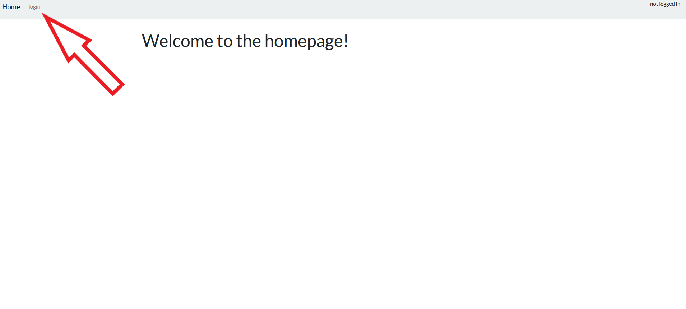
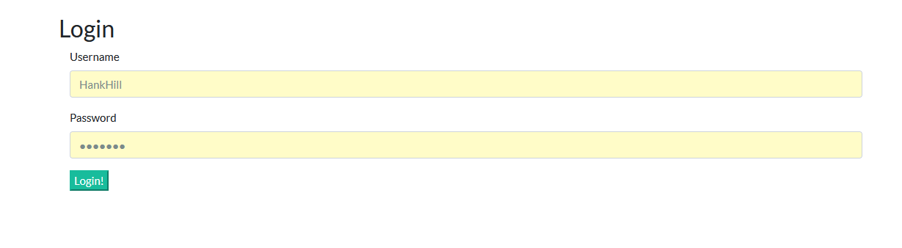
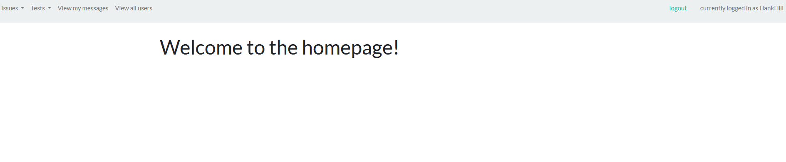
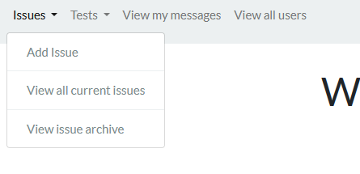
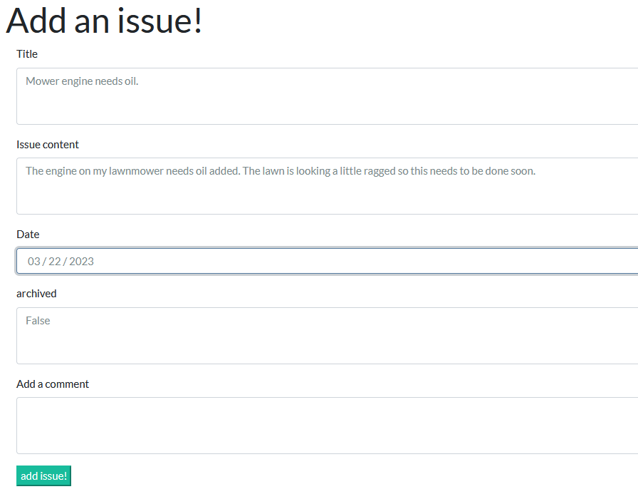
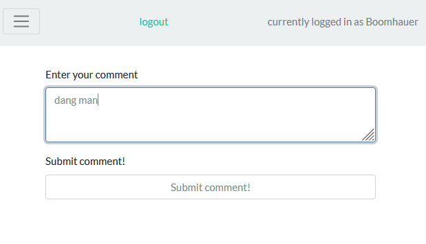
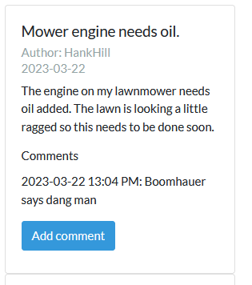
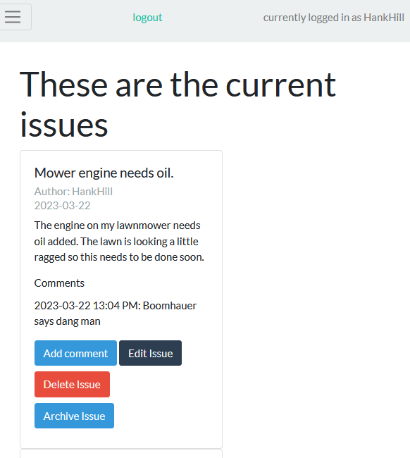
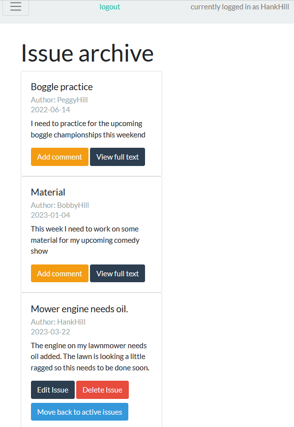

# Issue Tracker

### by Victor Delgado

# https://issue-tracker-v1.herokuapp.com/

**This is a web app I designed to help communicate with my team mates at work.**

My team works with environmental test chambers in different labs across a large building. This app is for sharing test information (location, duration, etc), and for sharing issues/ problems. 

# User flow

### logging in

**click the login link at the top left**

**Enter your login details (password changing is coming soon, until then don't forget your password)**

## Main app functions

**After logging in, you'll see the main page. More stuff is coming to this main page like humidity forecasts, test forecasts,** **upcoming meetings, etc.**

### Issues

**Something needs attention? Add an issue. (User tagging in issues and alerts are coming soon)**

**After adding an issue, all users can see the current issues and comment on them.**

**When an issue is resolved, only the user who created the issue can put it in the archive. They can make another comment or move it out of the archive back into active**

