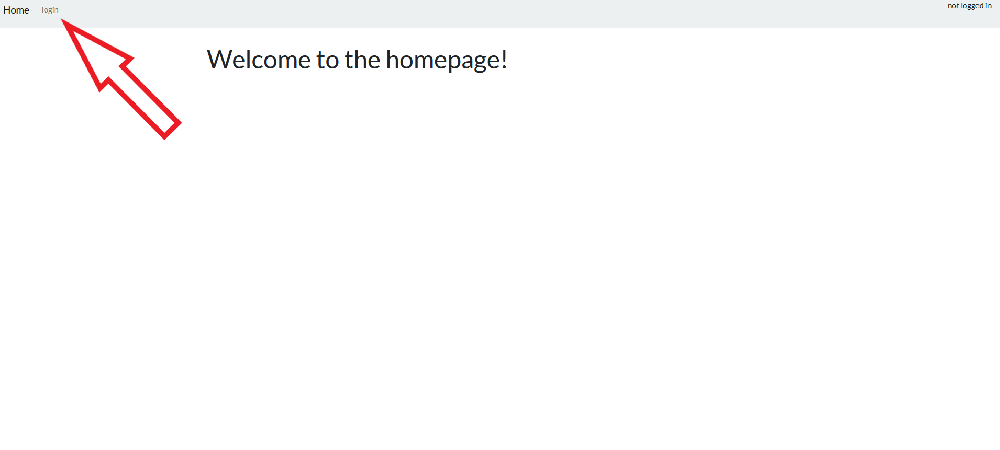

# Issue Tracker

### by Victor Delgado

This is a web app I designed to help communicate with my team mates at work. 

My team works with environmental test chambers in different labs across a large building. This app is for sharing test information (location, duration, etc), and for sharing issues/ problems. 

# User flow

### logging in

click the login link at the top left

Enter your login details (don't forget your info, I haven't implemented password reset yet)

